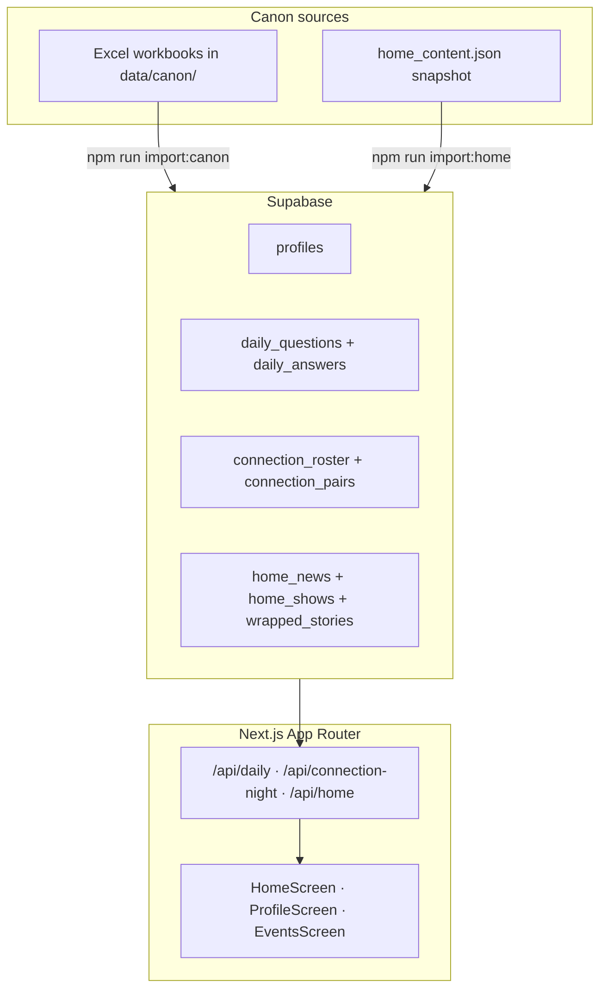

# LIGO — Demo Mockup (v1)

An interactive, clickable prototype of **LIGO** — a music-first social app for college students. The demo runs inside an iPhone frame in the browser: answer a daily question, reveal who picked like you, browse events, and flip through a weekly Wrapped story.

**v1 status:** Canon content lives in **Supabase**. The home feed, daily reveal, connection night, and profile answer trail read from server APIs. Profile-rich UI (playlists, receipts, streaks) still lives in TypeScript for now.

---

## What this demo is trying to show

LIGO is not a generic social feed. The loop is:

1. **Daily pick** — Everyone on campus gets the same question each day. You lock in one answer (song, artist, or vibe).
2. **Connection Night** — At reveal time, you see who answered like you. Directional copy explains *why* you matched. Some pairs get a special “shared pick” card; others get a taste overlap lane.
3. **Wrapped** — A Spotify Wrapped-style story summarizing your week in answers, shows, and “answer twins.”
4. **Profile** — Archetype, taste signals, and an answer trail tied to the same 28-day canon.

The demo uses **nine fictional Georgetown students** with distinct taste lanes (house head, country romantic, alt socialite, etc.). Switch profiles from the home top bar to see how the same product feels for different people — different news, shows, matches, and Wrapped stories.

Nothing here is “computed live” from real listening data. It is a **scripted, spreadsheet-driven demo** designed to feel coherent when you click around.

---

## The nine demo profiles

Each profile has an identity, archetype, and visual gradient. Taste is implied through their feed and matches — not enumerated here.

| ID | Name | Archetype | Vibe (one line) |
|----|------|-----------|-----------------|
| `jordan` | Jordan D. | The Hypnotist | Late-night house, Keinemusik energy, niche dancefloor head |
| `cole` | Cole B. | The Social Aux | Pregame rap/country crossover, campus party connector |
| `charlotte` | Charlotte W. | The Pop Oracle | Taylor Swift, Sabrina, Frank — main-character pop canon |
| `caroline` | Caroline M. | The Southern Romantic | Country tailgates, Morgan Wallen, heartbreak anthems |
| `maddie` | Maddie R. | The Alt Socialite | Brat summer, hyperpop, algorithm-dodging party girl |
| `bennett` | Bennett R. | The Pregame Menace | Rage rap, bass-heavy aux, chaos energy |
| `marcus` | Marcus T. | The Deep Cut Generalist | Psych-indie, house, classic rock — different lane with everyone |
| `alessia` | Alessia C. | The Afterglow | Floor-to-feelings: techno pregame, devastating afters |
| `sofia` | Sofia L. | The Mood Curator | Soft indie, Faye Webster / Clairo emotional bridge |

Profile switcher persists in `localStorage` (`ligo:active_user`). Most session state (today’s locked answer, vibe/spark taps) is local-only.

---

## Home experience (three states)

Reached via **“This week on Ligo”** cards — no top toggle.

| State | What you see |
|-------|----------------|
| **Normal** | Daily pick question, reveal countdown, Connections/Wrapped teasers, “Your artists this week” news strip, “Near you” shows |
| **Connection** | Sealed “Tonight’s Reveal” → story carousel of matches → summary + plan-a-hang sheet (Vibe / Spark, no DMs) |
| **Wrapped** | Sealed open → five-slide story (horoscope, answers, shows, twins, share) |

Bottom nav: **Events · Home · Profile**.

---

## Architecture (v1)



**Design choices:**

- Browser calls **Next.js API routes**, not Supabase directly (same pattern across daily, connection, home).
- Canon copy and scores are **verbatim from spreadsheets** — import scripts do not invent match logic.
- Assets stay in `public/`; the database stores paths only (`/covers/...`, `/assets/...`, `/artists/...`).
- Demo tables use **public read RLS**; writes go through import scripts with the service role key.

### What reads from Supabase (wired)

| Surface | API | Hook / consumer |
|---------|-----|-----------------|
| Daily question + answer trail | `GET /api/daily?profile=` | `useDailyReveal` → Daily Pick, Profile Answer Trail |
| Connection Night roster | `GET /api/connection-night?profile=` | `useConnectionNight` → Home Connection carousel |
| News, shows, Wrapped | `GET /api/home?profile=` | `useHomeContent` → NewsStrip, NearYou, WrappedExperience |

Daily “current day” resolves in Eastern Time against a fixed canon window (`2026-05-08` → `2026-06-04`); outside that window the demo clamps to day 28.

### What still lives in code (v1)

| Item | Location | Notes |
|------|----------|-------|
| Profile presentation | `lib/users.tsx` | Playlists, receipts, streaks, horoscope chips, notifications |
| Song autocomplete catalogs | `lib/*-catalog.ts` | Per-profile search for daily pick lock-in |
| Events feed | `components/EventsScreen.tsx` | Not migrated to Supabase in v1 |
| Week teaser countdown | `HomeScreen.tsx` | Schedule math, not profile content |
| Session / lock-in | `localStorage` | Today’s answer, active user |

---

## Canon data

Spreadsheets in `data/canon/`:

| File | Purpose |
|------|---------|
| `Ligo_28_Day_Daily_Answers_Matrix.xlsx` | 28 questions × 9 profiles |
| `Ligo_Connection_Seed.xlsx` | Connection pairs (reference) |
| `Ligo_Directional_Copy.xlsx` | Per-viewer roster copy for Connection Night |
| `Ligo_SharedPick_Rule.xlsx` | Which pairs show the shared-pick card vs taste grid |
| `home_content.json` | Exported news, shows, wrapped per profile |

Import rules: scores and copy come from cells only; `connection_roster` is the runtime source for Connection Night; shared-pick visibility is rule-driven in `lib/sharedPickRule.ts`.

---

## Setup

### 1. Install and env

```bash
npm install
cp .env.example .env.local
```

Fill in from Supabase **Project Settings → API**:

```env
NEXT_PUBLIC_SUPABASE_URL=...
NEXT_PUBLIC_SUPABASE_ANON_KEY=...
SUPABASE_SERVICE_ROLE_KEY=...   # import scripts only — never commit
```

### 2. Database

Run migrations in order via Supabase **SQL Editor** (or `npm run db:migrate` if direct Postgres access works):

1. `supabase/migrations/001_initial_schema.sql`
2. `supabase/migrations/002_home_content.sql`

### 3. Seed content

```bash
npm run import:canon      # profiles, daily, connection roster
npm run import:home       # news, shows, wrapped stories
```

Dry-run variants: `import:canon:dry`, `import:home:dry`.

### 4. Run

```bash
npm run dev
```

Open http://localhost:3000. If the port is busy, Next.js may use 3001 — check the terminal.

```bash
npm run dev:clean   # wipe .next and force port 3000
npm run build       # production build check
```

The app is behind a simple **password gate** (`middleware.ts` + `app/api/auth/`). Configure via your existing auth env if deployed.

---

## Project structure

```
app/
  page.tsx                 Phone shell — Home / Events / Profile tabs
  api/
    daily/route.ts           Daily reveal bundle
    connection-night/route.ts
    home/route.ts
    auth/route.ts            Password gate
    dev/canon/route.ts       Dev canon inspector
components/
  HomeScreen.tsx             Normal · Connection · Wrapped
  EventsScreen.tsx           Events tab (TS mock data)
  profile/ProfileScreen.tsx  Profile v2 + answer trail
  IOSDevice.tsx              iPhone frame
hooks/
  useDailyReveal.ts
  useConnectionNight.ts
  useHomeContent.ts
lib/
  users.tsx                  Profile presentation blobs
  dailyReveal.ts             Day resolution (ET window)
  connectionNight.ts         Roster → carousel mapping
  sharedPickRule.ts          Shared-pick card rules
  wrappedContent.ts          Wrapped normalize + JSON fallback
  supabase/                  Client, server, queries, types
data/canon/                  Excel + home_content.json
scripts/
  import-canon.ts
  import-home-content.ts
  apply-migration.ts
supabase/migrations/         001 canon · 002 home content
public/                      Covers, artist photos, fonts, assets
archive/investor-demo/       Offline investor deck (not part of runtime demo)
docs/                        Phase plans and implementation notes
```

---

## npm scripts

| Script | Purpose |
|--------|---------|
| `npm run dev` | Development server |
| `npm run dev:clean` | Clear `.next`, start on port 3000 |
| `npm run db:migrate` | Apply SQL migrations (needs DB URL) |
| `npm run import:canon` | Excel → Supabase canon tables |
| `npm run import:home` | `home_content.json` → home_* tables |
| `npm run export:home` | One-time export from legacy TS constants → JSON |

---

## Design system

Visual language comes from the LIGO design kit: **Bricolage Grotesque**, warm neutrals, orange/yellow/purple accents, glass cards on dark takeover screens. Tokens live in `app/globals.css`, `app/home.css`, and `app/events.css`.

---

## Out of scope for v1

These were intentionally deferred:

- **Profile blobs in Supabase** (playlists, receipts, streaks) — still in `users.tsx`
- **Catalog songs in Supabase** — autocomplete uses per-profile TS catalogs
- **Events feed backend** — still hardcoded in `EventsScreen.tsx`
- **Live Wrapped** computed from real answers or attendance
- **Real auth / multi-user** — password gate + fictional profiles only

See `docs/SUPABASE_IMPLEMENTATION_PLAN.md` and `docs/PHASE_5_HOME_CONTENT_PLAN.md` for phase history.

---

## Starting a new experiment from this repo

**Tag v1 and branch:**

```bash
git tag v1-demo-mockup
git checkout -b experiment/my-idea
```

**Or fork fresh:** copy `data/canon/`, `supabase/migrations/`, import scripts, `lib/users.tsx` (profiles), and `public/assets/` into a new Next app; use a **new Supabase project** so v1 data stays frozen.

---

## Stack

- **Next.js 14** (App Router) · **React 18** · **TypeScript**
- **Supabase** (Postgres + RLS)
- **Tailwind CSS** · design tokens in CSS
- Deployable on **Vercel** (set Supabase env vars + password gate secret)

---

## License / usage

Private demo mockup. Fictional students, fictional copy, third-party artist imagery for presentation only.
